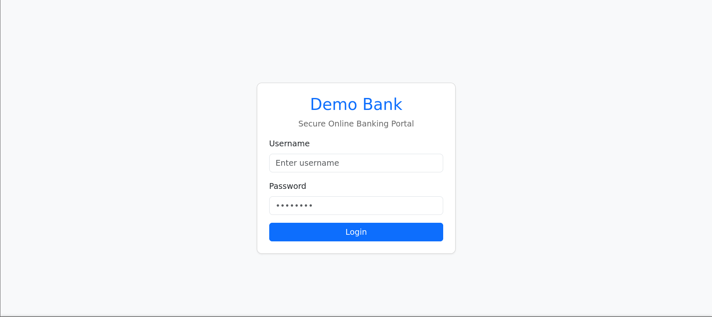

# brute_elsc

This website exists *purely* as a testing and development sandbox, created for prototyping, debugging, and validating features in a safe, controlled, and innovation-forward environment. Everything hosted here — including the codebase, UI elements, backend workflows, and any experimental functionalities — is intended solely for learning, experimentation, and iterative improvement. Under no circumstances should any part of this platform be replicated, redistributed, exploited, or deployed for harmful, unethical, illegal, or disruptive purposes. Seriously, this is not your gateway to becoming a discount supervillain or a budget hacker. Any misuse, including attempts to breach security, manipulate data, break systems, or cause operational chaos, is strictly prohibited and goes against the foundational principles of responsible digital citizenship and professional integrity. By interacting with this site, you acknowledge that it is not production-ready, may break unexpectedly, and should not be treated as a final product or a launch-ready solution. The primary goal is transparent experimentation and growth — so please keep it respectful, ethical, and aligned with the intended purpose. If you're here to learn, test, or vibe with the development process, welcome aboard. If you're here to cause trouble… yeah, this ain’t the platform for your villain origin story.

